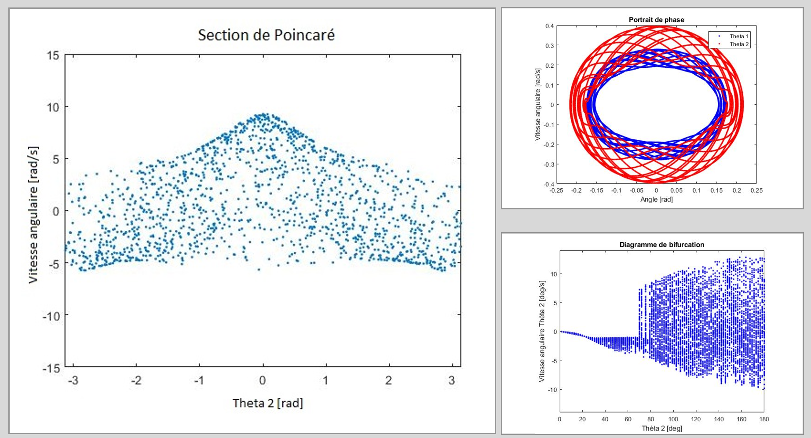

# double-pendulum :computer::triangular_ruler::chart_with_upwards_trend:
[](https://github.com/gforien/double-pendulum/releases)

[](https://github.com/gforien/double-pendulum/blob/master/LICENSE)
### Exhaustive numerical simulation of the double pendulum in Matlab


## Launching from MATLAB
```
>> PenduleDouble                                         % no parameters
```

## Functionnalities
- Tweaking of all parameters (masses, lengths, inital angles and speeds)
- Animation: Solving non-linear equations (ODE45, Newmark+Newton-Raphson)
- Animation: 2 non-linear pendulum released with 0.1° difference of inital angle
- Graph: Phase portait and Poincaré map
- Graph: Energy of the system vs. time
- Graph: Bifurcation diagram
- Animation: Solving linear equations of the double-pendulum (ODE45, Verlet, analytical solutions)
- Animation: Comparison of linear vs. non-linear pendulums
- Graph: (SSE between linear & non-linear solutions) vs. initial angle
- and more...



#
#### Rémi Bacot, Gabriel Forien, Mariem Ksouri, Agathe Menon, Pierre-Adrien Millot <br/>P2I7 - Modélisation numérique pour l'ingénieur - Sujet 8 <br/>Professeur référent : Sébastien Baguet<br />PCC2A INSA Lyon 2018

